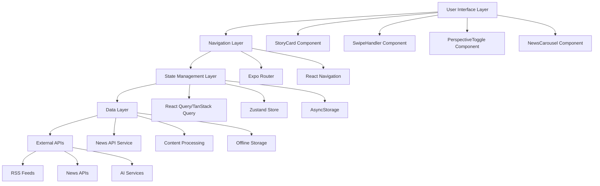
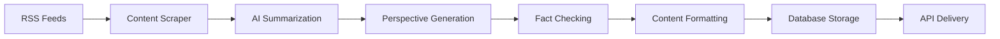

# NewsSwipe App Design Document

## Overview

NewsSwipe is a TikTok-inspired mobile news application built on React Native with Expo. The app presents political news stories in an engaging, swipeable format that allows users to explore different political perspectives through intuitive gestures. The design leverages the existing Expo Router setup and extends it with specialized components for news consumption.

## Architecture

### High-Level Architecture



### Technology Stack Extensions

Building on the existing Expo setup, we'll add:

- **TanStack Query (React Query)**: Data fetching and caching
- **Zustand**: Lightweight state management
- **React Native Gesture Handler**: Advanced gesture recognition (already installed)
- **React Native Reanimated**: Smooth animations (already installed)
- **Expo Haptics**: Tactile feedback (already installed)
- **React Native MMKV**: High-performance storage
- **React Native Fast Image**: Optimized image loading

## Components and Interfaces

### Core Data Models

```typescript
interface NewsStory {
  id: string;
  headline: string;
  category: 'politics' | 'economy' | 'social';
  publishedAt: Date;
  imageUrl: string;
  videoUrl?: string;
  readTime: number; // in seconds
  perspectives: {
    neutral: NewsPerspective;
    liberal: NewsPerspective;
    conservative: NewsPerspective;
  };
  engagement: EngagementMetrics;
  sources: SourceAttribution[];
}

interface NewsPerspective {
  summary: string;
  keyPoints: string[];
  angle: string;
  source: string;
  credibilityScore: number;
  wordCount: number;
}

interface EngagementMetrics {
  views: number;
  shares: number;
  averageTimeSpent: number;
  perspectiveSwitches: number;
  bookmarks: number;
}

interface UserPreferences {
  preferredPerspective: 'neutral' | 'liberal' | 'conservative' | 'balanced';
  categories: string[];
  notificationsEnabled: boolean;
  autoPlayEnabled: boolean;
  hapticFeedbackEnabled: boolean;
}
```

### Component Architecture

#### 1. StoryCard Component

**Purpose**: Full-screen story display with perspective switching

```typescript
interface StoryCardProps {
  story: NewsStory;
  currentPerspective: 'neutral' | 'liberal' | 'conservative';
  onPerspectiveChange: (perspective: string) => void;
  onShare: () => void;
  onBookmark: () => void;
  isActive: boolean;
}
```

**Key Features**:
- Auto-advance timer (30-45 seconds)
- Perspective indicator with color coding
- Share/bookmark functionality
- Progress indicator
- Source attribution overlay

#### 2. SwipeHandler Component

**Purpose**: Gesture recognition and navigation control

```typescript
interface SwipeHandlerProps {
  onSwipeLeft: () => void;
  onSwipeRight: () => void;
  onSwipeDown: () => void;
  onTap: () => void;
  children: React.ReactNode;
  hapticEnabled: boolean;
}
```

**Gesture Mapping**:
- Swipe Left: Democratic/Liberal perspective
- Swipe Right: Republican/Conservative perspective  
- Swipe Down: Next story
- Tap: Pause/resume auto-scroll

#### 3. NewsCarousel Component

**Purpose**: Infinite scroll implementation with pre-loading

```typescript
interface NewsCarouselProps {
  stories: NewsStory[];
  currentIndex: number;
  onStoryChange: (index: number) => void;
  preloadCount: number;
}
```

**Features**:
- Infinite scroll with circular buffer
- Pre-loading next 3-5 stories
- Memory management for performance
- Smooth transitions between stories

#### 4. PerspectiveToggle Component

**Purpose**: Visual indicator and manual perspective switching

```typescript
interface PerspectiveToggleProps {
  currentPerspective: 'neutral' | 'liberal' | 'conservative';
  onPerspectiveChange: (perspective: string) => void;
  showLabels: boolean;
}
```

### Navigation Structure

```
app/
├── _layout.tsx (Root layout with theme provider)
├── (news)/
│   ├── _layout.tsx (News-specific layout)
│   ├── index.tsx (Main news feed)
│   ├── story/[id].tsx (Individual story view)
│   └── bookmarks.tsx (Saved stories)
├── (settings)/
│   ├── _layout.tsx
│   ├── preferences.tsx
│   └── about.tsx
└── +not-found.tsx
```

## Data Models

### Content Processing Pipeline



### Data Flow Architecture

1. **Content Ingestion**: RSS feeds scraped every 15-30 minutes
2. **AI Processing**: GPT-4/Claude generates perspective summaries
3. **Quality Control**: Fact-checking and bias detection
4. **Storage**: Processed content stored with metadata
5. **Delivery**: Real-time updates pushed to mobile clients

### Local Storage Strategy

```typescript
interface LocalStorageSchema {
  stories: NewsStory[];
  userPreferences: UserPreferences;
  readingHistory: ReadingSession[];
  bookmarkedStories: string[];
  offlineContent: NewsStory[];
}
```

**Storage Implementation**:
- **MMKV**: User preferences and app state
- **SQLite**: Story content and reading history
- **AsyncStorage**: Fallback for simple key-value pairs

## Error Handling

### Error Categories and Responses

1. **Network Errors**
   - Graceful degradation to cached content
   - Offline mode with previously downloaded stories
   - Retry mechanisms with exponential backoff

2. **Content Processing Errors**
   - Fallback to original article text
   - Error logging for content quality monitoring
   - User notification for missing perspectives

3. **Gesture Recognition Errors**
   - Fallback to button-based navigation
   - Sensitivity adjustment based on device
   - Accessibility alternatives

4. **Performance Issues**
   - Memory cleanup for large story queues
   - Image compression and lazy loading
   - Background processing throttling

### Error Boundaries

```typescript
interface ErrorBoundaryState {
  hasError: boolean;
  errorType: 'network' | 'content' | 'gesture' | 'unknown';
  retryCount: number;
}
```

## Testing Strategy

### Unit Testing

**Components to Test**:
- StoryCard rendering with different perspectives
- SwipeHandler gesture recognition
- NewsCarousel infinite scroll logic
- Data transformation utilities

**Testing Tools**:
- Jest for unit tests
- React Native Testing Library for component tests
- Detox for E2E testing

### Integration Testing

**Key Scenarios**:
- Story navigation flow
- Perspective switching accuracy
- Offline mode functionality
- Push notification handling

### Performance Testing

**Metrics to Monitor**:
- Memory usage during long scrolling sessions
- Animation frame rates (target: 60fps)
- Network request efficiency
- Battery consumption

### Accessibility Testing

**Requirements**:
- Screen reader compatibility
- Voice control support
- High contrast mode support
- Gesture alternatives for motor impairments

## Design System Implementation

### Color System

```typescript
const ColorPalette = {
  primary: '#000000',
  secondary: '#1A1A1A',
  accentBlue: '#1DA1F2', // Democratic
  accentRed: '#FF3040',  // Republican
  neutral: '#F5F5F5',
  textPrimary: '#FFFFFF',
  textSecondary: '#A0A0A0',
  glassmorphism: 'rgba(255, 255, 255, 0.1)',
} as const;
```

### Typography System

```typescript
const Typography = {
  headline: {
    fontFamily: 'Inter-Bold',
    fontSize: 32,
    lineHeight: 38,
  },
  body: {
    fontFamily: 'Inter-Regular',
    fontSize: 18,
    lineHeight: 26,
  },
  caption: {
    fontFamily: 'Inter-Medium',
    fontSize: 14,
    lineHeight: 20,
  },
} as const;
```

### Animation Specifications

- **Story Transitions**: 300ms ease-out
- **Perspective Switches**: 200ms ease-in-out with color interpolation
- **Gesture Feedback**: 100ms haptic + visual feedback
- **Loading States**: Skeleton screens with shimmer effect

## Performance Optimization

### Memory Management

1. **Story Queue Management**: Maintain maximum 10 stories in memory
2. **Image Caching**: LRU cache with 50MB limit
3. **Component Recycling**: Reuse story card components
4. **Background Processing**: Throttle non-critical operations

### Network Optimization

1. **Request Batching**: Combine multiple API calls
2. **Compression**: Gzip for text content, WebP for images
3. **CDN Integration**: Global content delivery
4. **Prefetching**: Intelligent content pre-loading

### Battery Optimization

1. **Animation Throttling**: Reduce animations when battery low
2. **Background Sync**: Limit frequency based on usage patterns
3. **Screen Brightness**: Adapt to ambient light
4. **Network Usage**: Prefer WiFi for large downloads

This design provides a comprehensive foundation for building the NewsSwipe app while leveraging the existing Expo/React Native infrastructure and ensuring scalability, performance, and user experience excellence.